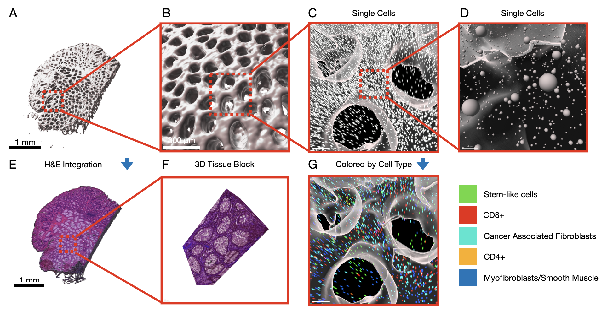

# SpaceMap

**Reconstructing atlas-level single-cell 3D tissue maps from serial sections**

SpaceMap is an open-source framework for reconstructing atlas-level single-cell 3D tissue maps from serial sections. It integrates single-cell coordinates with optional histological image features to assemble serial sections into 3D models, combining multi-scale feature matching with large-deformation diffeomorphic metric mapping (LDDMM) to deliver global reconstructions while preserving local micro-anatomy.


## Key Features

- **Multi-modal Registration**: Combines cell coordinates, cell types, gene expression, and histological images for robust alignment
- **Two-stage Registration Approach**: Efficient coarse alignment followed by precise fine registration
- **Advanced Feature Matching**: Combines deep learning (LoFTR) with traditional computer vision methods (SIFT)
- **GPU-accelerated LDDMM**: Optimized for handling large-scale cellular data from multiple tissue sections
- **Global Consistency**: Ensures structural coherence between non-adjacent sections
- **High Performance**: ~2-fold more accurate than PASTE and STalign while running on standard laptop hardware

## Applications

SpaceMap has been successfully applied to build high-resolution 3D tissue maps of:

- Serial sectioned spatial transcriptomics (Xenium, ~2M cells)
- Spatial proteomics dataset (CODEX, ~1M cells)
- 3D models for diseased (colon polyp) and reference colon

## Quick Start

```python
import spacemap
from spacemap import Slice
import pandas as pd

# Load cell coordinate data from CSV
df = pd.read_csv("cells.csv.gz")
groups = df.groupby("layer")

# Organize data by layers
xys = []  # xy coordinates for each layer
ids = []  # layer IDs

for layer, dff in groups:
    xy = dff[["x", "y"]].values
    ids.append(layer)
    xys.append(xy)

# Set up project
base = "data/flow"
flow = spacemap.flow.FlowImport(base)
flow.init_xys(xys, ids)
slices = flow.slices

# Perform affine registration for coarse alignment
mgr = spacemap.flow.AutoFlowMultiCenter3(slices)
mgr.alignMethod = "auto"
mgr.affine("DF", show=True)

# Perform LDDMM for precise alignment
mgr.ldm_pair(Slice.align1Key, Slice.align2Key, show=True)

# Export results
export = spacemap.flow.FlowExport(slices)
```

## Installation

```bash
pip install spacemap
```

For detailed installation instructions, see the [Installation Guide](installation.md).

## Methodology

SpaceMap employs a two-stage registration approach:

1. **Coarse Alignment**: Applies affine transformations for adjacent sections, computationally efficient and avoids local optima
2. **Fine Mapping**: Focuses exclusively on local non-linear deformations using GPU-accelerated LDDMM

For more details on the methodology, refer to our paper: [Citation information]


## Applications

SpaceMap has been successfully applied to build high-resolution 3D tissue maps of:

- Serial sectioned spatial transcriptomics (Xenium, ~2M cells)
- Spatial proteomics dataset (CODEX, ~1M cells)
- 3D models for diseased (colon polyp) and reference colon



## Citation

If you use SpaceMap in your research, please cite our paper:

```
[Citation details]
``` 