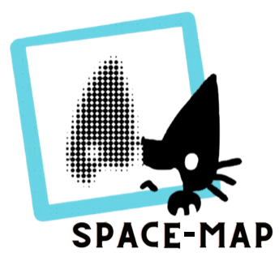
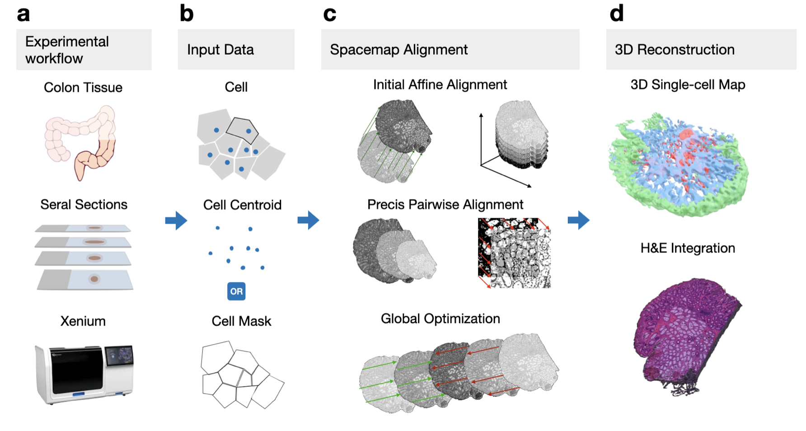

# Space-map

**Reconstructing atlas-level single-cell 3D tissue maps from serial sections**

Space-map is an open-source framework for reconstructing atlas-level single-cell 3D tissue maps from serial sections. It integrates single-cell coordinates with optional histological image features to assemble serial sections into 3D models, combining multi-scale feature matching with large-deformation diffeomorphic metric mapping (LDDMM) to deliver global reconstructions while preserving local micro-anatomy.

High‑resolution three‑dimensional (3D) tissue atlases are transforming how we study cellular architecture‑function relationships in human tissues. However, an accurate and efficient reconstruction method that can handle atlas-scale datasets remains elusive. Space-map addresses this challenge by combining multi‑scale feature matching with large‑deformation diffeomorphic metric mapping, delivering global reconstructions while preserving local micro‑anatomy.



## Key Features

- **Multi-modal Registration**: Combines cell coordinates, cell types, gene expression, and histological images for robust alignment
- **Two-stage Registration Approach**: Efficient coarse alignment followed by precise fine registration
- **Advanced Feature Matching**: Combines deep learning (LoFTR) with traditional computer vision methods (SIFT)
- **GPU-accelerated LDDMM**: Optimized for handling large-scale cellular data from multiple tissue sections
- **Global Consistency**: Ensures structural coherence between non-adjacent sections
- **High Performance**: ~2-fold more accurate than PASTE and STalign while running on standard laptop hardware

## Applications

Space-map has been successfully applied to build high-resolution 3D tissue maps of:

- Serial sectioned spatial transcriptomics (Xenium, ~2.9M cells)
- Spatial proteomics dataset (CODEX, ~2.4M cells)
- 3D models for diseased (colon polyp) and reference colon

## Quick Start

```python
import spacemap
from spacemap import Slice
import pandas as pd

# Load cell coordinate data from CSV
df = pd.read_csv("cells.csv.gz")
groups = df.groupby("layer")

# Organize data by layers
xys = []  # xy coordinates for each layer
ids = []  # layer IDs

for layer, dff in groups:
    xy = dff[["x", "y"]].values
    ids.append(layer)
    xys.append(xy)

# Set up project
base = "data/flow"
flow = spacemap.flow.FlowImport(base)
flow.init_xys(xys, ids)
slices = flow.slices

# Perform affine registration for coarse alignment
mgr = spacemap.flow.AutoFlowMultiCenter3(slices)
mgr.alignMethod = "auto"
mgr.affine("DF", show=True)

# Perform LDDMM for precise alignment
mgr.ldm_pair(Slice.align1Key, Slice.align2Key, show=True)

# Export results
export = spacemap.flow.FlowExport(slices)
```

## Installation

```bash
pip install spacemap
```

For detailed installation instructions, see the [Installation Guide](installation.md).

## Methodology

Space-map employs a two-stage registration approach:

1. **Coarse Alignment**: Applies affine transformations for adjacent sections, computationally efficient and avoids local optima
2. **Fine Mapping**: Focuses exclusively on local non-linear deformations using GPU-accelerated LDDMM

For more details on the methodology, refer to our paper: [Citation information]



## Applications

Space-map has been successfully applied to build high-resolution 3D tissue maps of:

- Serial sectioned spatial transcriptomics (Xenium, ~2.9M cells)
- Spatial proteomics dataset (CODEX, ~2.4M cells)
- 3D models for diseased (colon polyp) and reference colon


## Authors

- **Rongduo Han**<sup>1,2,*</sup> - Implementation, Writing
- **Chenchen Zhu**<sup>3,*</sup> - Conceptualization, Data Analysis, Writing
- **Cihan Ruan**<sup>2,*</sup> - Conceptualization, Writing
- **Bingqing Zhao**<sup>3</sup> - Xenium Experiment
- **Yuqi Tan**<sup>4</sup> - CODEX Data Processing
- **Emma Monte**<sup>2</sup> - Project Management
- **Bei Wei**<sup>5,2</sup> - CODEX Experiment
- **Joanna Bi**<sup>2</sup> - Xenium and CODEX Experiments
- **Thomas V. Karathanos**<sup>3</sup>
- **Rozelle Laquindanum**
- **Greg Charville**<sup>4</sup>
- **Meng Wang**<sup>6</sup>
- **Yiing Lin**
- **James M. Ford**
- **Garry Nolan**
- **Michael Snyder**<sup>3,#</sup> - Conceptualization, Writing

<sup>1</sup> College of Software, Nankai University, Tianjin, China  
<sup>2</sup> Department of Computer Science and Engineering, Santa Clara University, Santa Clara, CA, USA  
<sup>3</sup> Department of Genetics, Stanford School of Medicine, Stanford, CA 94305  
<sup>4</sup> Department of Pathology, Stanford School of Medicine, Stanford, CA 94305  
<sup>5</sup> Sun Yat-Sen Memorial Hospital, Sun Yat-Sen University, Guangzhou, Guangdong, P.R.China  
<sup>6</sup> Michigan University  

<sup>*</sup> These authors contributed equally to this study  
<sup>#</sup> Correspondence to: mpsnyder@stanford.edu

## Acknowledgments

We gratefully thank:
- Pauline Chu from Stanford Human Pathology/Histology Service Center for sectioning tissues and preparing slides
- Shubham/Shannon for colectomy
- Teri, Jeanne, Zhengyan (Yiing's lab), Uri, and Ed for their contributions

### Funding

This work was funded by:
- NIH Common Fund HuBMAP program (Phase 1 U54HG010426 and Phase 2 U54HG012723)
- NCI HTAN program (U2CCA233311)
- HuBMAP JumpStart Fellowship (3OT2OD033759-01S3)
- AWS Cloud Credit for Research

The funding sources had no role in the design of the study, data analysis, or preparation of the manuscript.

## Citation

If you use Space-map in your research, please cite our paper:

```
[Citation details]
``` 