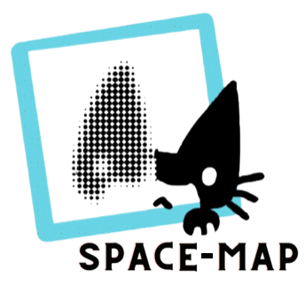
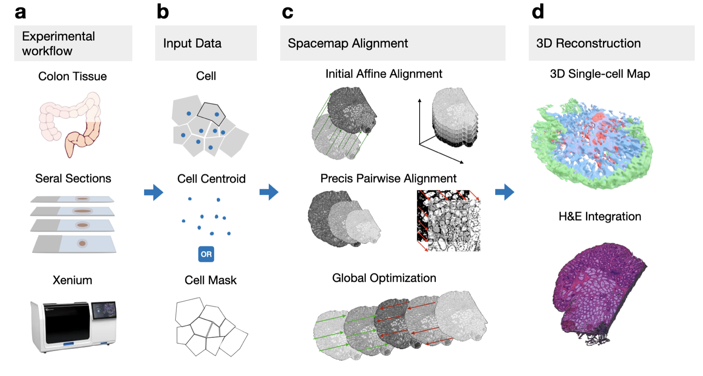

# Space-map

**Reconstructing atlas-level single-cell 3D tissue maps from serial sections**

## About Space-map

Space-map is an open-source framework for reconstructing atlas-level single-cell 3D tissue maps from serial sections. It integrates single-cell coordinates with optional histological image features to assemble consecutive tissue sections into coherent 3D models, combining multi-scale feature matching with large-deformation diffeomorphic metric mapping (LDDMM) to deliver global reconstructions while preserving local micro-anatomy.

High‑resolution three‑dimensional (3D) tissue atlases are transforming how we study cellular architecture‑function relationships in human tissues. However, an accurate and efficient reconstruction method that can handle atlas-scale datasets remains elusive. Space-map addresses this challenge by combining multi‑scale feature matching with large‑deformation diffeomorphic metric mapping, delivering global reconstructions while preserving local micro‑anatomy.



## Key Features

- **Multi-modal Registration**: Combines cell coordinates, cell types, gene expression, and histological images for robust alignment
- **Two-stage Registration Approach**: Efficient coarse alignment followed by precise fine registration
- **Advanced Feature Matching**: Combines deep learning (LoFTR) with traditional computer vision methods (SIFT)
- **GPU-accelerated LDDMM**: Optimized for handling large-scale cellular data from multiple tissue sections
- **Global Consistency**: Ensures structural coherence between non-adjacent sections
- **High Performance**: ~2-fold more accurate than PASTE and STalign while running on standard laptop hardware
- **Scalability**: Designed for atlas-scale datasets with millions of cells
- **Preservation of Structure**: Maintains micro-anatomical structures through diffeomorphic mapping
- **Flexibility**: Works with various spatial omics technologies (Xenium, CODEX, etc.)
- **Visualization**: Built-in tools for exploring and validating 3D reconstructions

## Applications

Space-map has been successfully applied to build high-resolution 3D tissue maps of:

- Serial sectioned spatial transcriptomics (Xenium, ~2.9M cells)
- Spatial proteomics dataset (CODEX, ~2.4M cells)
- 3D models for diseased (colon polyp) and reference colon

## Quick Start

```python
import spacemap
from spacemap import Slice
import pandas as pd

# Step 1: Load cell coordinate data
df = pd.read_csv("cells.csv.gz")

# Step 2: Organize data by layers
xys = []
layer_ids = []

for layer_id in sorted(df['layer'].unique()):
    layer_data = df[df['layer'] == layer_id]
    xy = layer_data[['x', 'y']].values
    xys.append(xy)
    layer_ids.append(layer_id)

# Step 3: Initialize project
BASE = "data/flow"
flowImport = spacemap.flow.FlowImport(BASE)
flowImport.init_xys(xys, ids=layer_ids)
slices = flowImport.slices

# Step 4: Perform affine registration (coarse alignment)
mgr = spacemap.flow.AutoFlowMultiCenter4(slices, Slice.rawKey)
mgr.alignMethod = "auto"
mgr.affine("DF", show=True)

# Step 5: Perform LDDMM (fine alignment)
mgr.ldm_pair(Slice.align1Key, Slice.align2Key, show=True)

# Step 6: Export results
export = spacemap.flow.FlowExport(slices)
```

See the [Quick Start Guide](overview/quickstart.md) for a complete tutorial.

## Installation

```bash
pip install spacemap
```

For detailed installation instructions, see the [Installation Guide](installation.md).

## Methodology

Space-map employs a two-stage registration approach:

1. **Coarse Alignment**: Applies affine transformations for adjacent sections, computationally efficient and avoids local optima
2. **Fine Mapping**: Focuses exclusively on local non-linear deformations using GPU-accelerated LDDMM

For more details on the methodology, refer to our paper: [Citation information]



## High-Level Architecture

The Space-map framework is organized around several interconnected systems that handle different aspects of the 3D reconstruction process. The system is centered on core registration capabilities (affine and LDDMM), supported by data management, feature matching, and visualization tools.

### System Architecture Diagram

[System architecture diagram will be added here]

## Registration Pipeline & Technical Approach

Space-map employs a multi-stage registration pipeline to achieve accurate alignment of tissue sections:

1. **Coarse Alignment**: Applies affine transformations between adjacent sections. This step is computationally efficient, handles global positioning and orientation, and avoids local optima that can trap non-linear methods.
2. **Fine Mapping**: Uses Large Deformation Diffeomorphic Metric Mapping (LDDMM) for local non-linear deformations, preserving micro-anatomical structures. This step is GPU-accelerated for high performance.

This two-stage approach allows Space-map to efficiently handle large datasets while capturing complex local deformations necessary for accurate tissue reconstruction.

**Multi-Resolution Processing:**
- The registration process starts with coarse alignment, followed by feature matching refinement and fine alignment using LDDMM.
- Parallel processing is used to handle multiple slice pairs efficiently, further improving scalability.

### Registration Process Flow

[Registration process flow diagram will be added here]

## Key Components

| Class                | Module                | Purpose                                                      |
|----------------------|----------------------|--------------------------------------------------------------|
| `FlowImport`         | flow                 | Handles data import and initialization of slice data         |
| `Slice`              | base.flowBase        | Manages individual tissue sections and their transformations |
| `AutoFlowMultiCenter`| flow                 | Orchestrates the registration workflow                       |
| `LDDMMRegistration`  | registration         | Performs non-linear deformable registration                  |
| `TransformDB`        | flow.outputs         | Stores and manages transformations between sections          |
| `FlowExport`         | flow                 | Handles exporting of aligned data and 3D models              |
| `find_matches`       | matches              | Identifies corresponding features between sections           |
| `affine_register`    | affine               | Performs affine registration for coarse alignment            |

### Component Relationships

[Component relationships diagram will be added here]

## Summary of Capabilities

Space-map offers several advantages for 3D tissue reconstruction:

1. **Integration of Multiple Data Types**: Combines cell coordinates, histology images, and other spatial data
2. **Scalability**: Designed for atlas-scale datasets with millions of cells
3. **Preservation of Structure**: Maintains micro-anatomical structures through diffeomorphic mapping
4. **Efficiency**: Two-stage registration with parallel processing optimizes computational resources
5. **Flexibility**: Works with various spatial omics technologies (Xenium, CODEX, etc.)
6. **Visualization**: Built-in tools for exploring and validating 3D reconstructions

These capabilities make Space-map suitable for creating comprehensive 3D models from serial tissue sections across a wide range of biological applications, from basic research to clinical studies.

## Authors

- **Rongduo Han**<sup>1,2,*</sup> - Implementation, Writing
- **Chenchen Zhu**<sup>3,*</sup> - Conceptualization, Data Analysis, Writing
- **Cihan Ruan**<sup>2,*</sup> - Conceptualization, Writing
- **Bingqing Zhao**<sup>3</sup> - Xenium Experiment
- **Yuqi Tan**<sup>4</sup> - CODEX Data Processing
- **Emma Monte**<sup>2</sup> - Project Management
- **Bei Wei**<sup>5,2</sup> - CODEX Experiment
- **Joanna Bi**<sup>2</sup> - Xenium and CODEX Experiments
- **Thomas V. Karathanos**<sup>3</sup>
- **Rozelle Laquindanum**
- **Greg Charville**<sup>4</sup>
- **Meng Wang**<sup>6</sup>
- **Yiing Lin**<sup>3</sup>
- **James M. Ford**<sup>3</sup>
- **Garry Nolan**<sup>3</sup>
- **Nam Ling**<sup>2</sup>
- **Michael Snyder**<sup>3,#</sup> - Conceptualization, Writing

<sup>1</sup> College of Software, Nankai University, Tianjin, China  
<sup>2</sup> Department of Computer Science and Engineering, Santa Clara University, Santa Clara, CA, USA  
<sup>3</sup> Department of Genetics, Stanford School of Medicine, Stanford, CA 94305  
<sup>4</sup> Department of Pathology, Stanford School of Medicine, Stanford, CA 94305  
<sup>5</sup> Sun Yat-Sen Memorial Hospital, Sun Yat-Sen University, Guangzhou, Guangdong, P.R.China  
<sup>6</sup> Michigan University  

<sup>*</sup> These authors contributed equally to this study  
<sup>#</sup> Correspondence to: mpsnyder@stanford.edu

## Acknowledgments

We gratefully thank:
- Pauline Chu from Stanford Human Pathology/Histology Service Center for sectioning tissues and preparing slides
- Shubham/Shannon for colectomy
- Teri, Jeanne, Zhengyan (Yiing's lab), Uri, and Ed for their contributions

### Funding

This work was funded by:
- NIH Common Fund HuBMAP program (Phase 1 U54HG010426 and Phase 2 U54HG012723)
- NCI HTAN program (U2CCA233311)
- HuBMAP JumpStart Fellowship (3OT2OD033759-01S3)
- AWS Cloud Credit for Research

The funding sources had no role in the design of the study, data analysis, or preparation of the manuscript.

## Citation

If you use Space-map in your research, please cite our paper:

```
[Citation details]
``` 